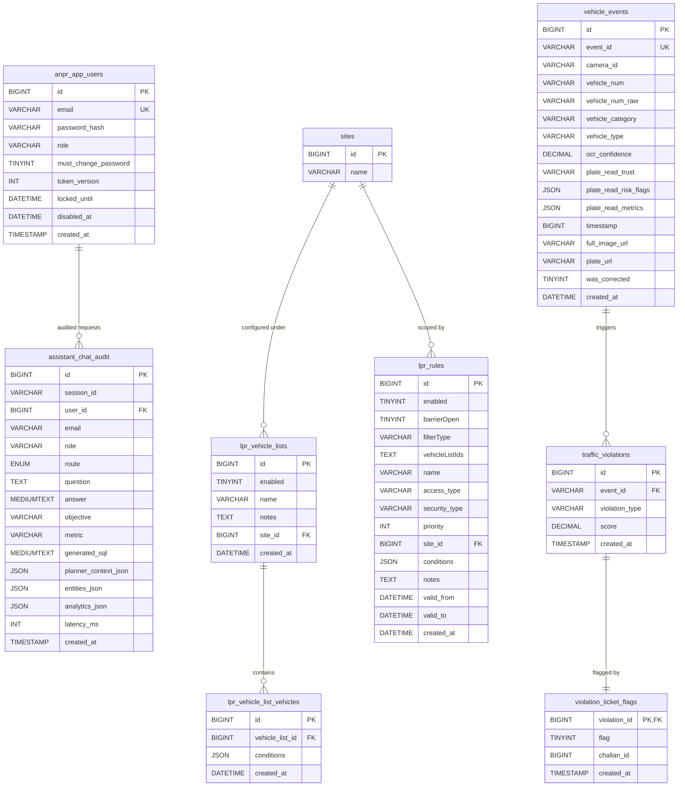
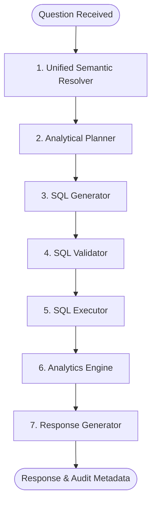

# ANPR Dashboard & AI Analytics Assistant: System Overview

The **ANPR Dashboard** is a Philippine National Police (PNP) smart traffic and Automatic Number Plate Recognition (ANPR) enforcement console. It is built using a modern decoupled architecture consisting of a React-based client web app, a Node/Express API server connected to MySQL and Redis, and twin Python-based AI analytics assistant services using LangGraph and LLMs.

---

## 1. System Architecture

The platform consists of the following primary components:

| Component | Technology Stack | Port | Purpose / Role |
| :--- | :--- | :--- | :--- |
| **`client/`** | React 19, Vite 8, Material UI (MUI) 6, Recharts, Leaflet | `5173` | PNP operations console, dashboard charts, vehicle search, live feeds, watchlists, and AI chat interfaces. |
| **`server/`** | Node.js, Express, MySQL 2, JWT, Nodemailer | `4000` | Exposes REST APIs, manages user auth, maps database operations, queries camera status, triggers alerts, and proxies AI assistant queries. |
| **`assistant_ai_service/`** | FastAPI, LangGraph, vLLM (Qwen2.5-7B), Redis | `9101` | Runs the stable or legacy assistant, which uses a semantic parsing planning graph to answer natural language questions about the database. |
| **`assistant_enhance_service/`** | FastAPI, LangGraph, vLLM (Qwen2.5-7B), Redis | `9103` | Runs the advanced analytical assistant, offering detailed semantic breakdown, debugging stats, and performance logging. |
| **MySQL (Docker)** | `mysql:8.0` | `3307` | Stores historical ANPR scans, violations, watchlists, and audit records. |
| **Redis (Docker)** | `redis:7-alpine` | `6380` | Manages session memory cache and semantic cache states for the AI assistants. |

---

## 2. Database Architecture

The schema (defined in `server/sql/dev_bootstrap.sql` and `server/sql/assistant_chat_audit.sql`) maps out traffic monitoring and system operations:



### Key Seed/Bootstrap Logic:
* **Demo Admin User**: Defaults to `admin@anpr.local` / `admin123`.
* **Automatic DB Hydration**: The server looks for `aiserver_anpr_last_3_days.sql` at startup. If the main tables are missing, it performs a full restore, ensuring local test databases are pre-populated.
* **Mock Fallback Database**: If the MySQL service is unreachable, `server/src/db.js` catches connection exceptions (`ECONNREFUSED`, `ER_BAD_DB_ERROR`, etc.) and seamlessly proxies queries using a mock database generator to prevent the API from crashing during configuration.

---

## 3. The LangGraph AI Assistant Pipeline

Both assistant services share a highly advanced query execution planning workflow structured as a **LangGraph state graph** (`assistant_ai_service/app/workflow/graph.py`).



### Node-by-Node Pipeline Execution:

1. **Unified Semantic Resolver Node**:
   * Analyzes the query text and the surrounding conversation context.
   * Leverages an LLM parse (`UNIFIED_SYSTEM` prompt) to determine:
     * **Business Concept**: E.g., `plate_reads`, `vehicle_detections`, `vehicles`, `violations`, `challans`, `camera_activity`, `watchlist_hits`.
     * **Objective**: Analytical intent (e.g., `metric_summary`, `breakdown`, `trend`, `comparison`, `ranking`, `growth`, `record_detail`).
     * **Dimensions & Entities**: Scopes down the target columns, locations, violation types, or plate suffixes.
     * **Temporal Scope**: Resolves absolute or relative time ranges (e.g., "yesterday", "last 30 days") centered on the Manila timezone (`Asia/Manila`).
2. **Analytical Planner Node**:
   * Combines resolved semantic variables with preceding conversational history to construct the logical plan (`AnalyticalPlan`).
   * Manages scope inheritance (e.g., carrying over camera locations, time ranges, and filters from previous chat rounds).
3. **SQL Generator Node**:
   * Translates the logical planning representation into standard, executable MySQL queries using predefined table templates.
4. **SQL Validator Node**:
   * Validates the generated SQL syntax using `sqlparse` and safeguards the database against broad scans by injecting limit parameters.
5. **SQL Executor Node**:
   * Executes the generated query against the active database pool, returning structured rows and column schemas.
6. **Analytics Engine Node**:
   * Performs analytical post-processing on the raw dataset (e.g., ranking aggregations, calculating comparative growth rates, identifying peaks and outliers).
7. **Response Generator Node**:
   * Synthesizes the analysis and parsed rows into a human-readable markdown response, returning detailed debugging context (latencies, token counts, generated queries) for inspection.

---

## 4. UI Layout & Operational Routes

The React application implements a responsive PNP enforcement layout containing 13 main routing views:

* **Dashboard (`/dashboard`)**: Displays real-time operational widgets (e.g., violation frequency, online camera counts, unique plates scanned) along with time-series charts updating at 10-second intervals.
* **Vehicle Report (`/vehicle-report`)**: An analytics-heavy grid view enabling operators to search historical plate entries filtered by date ranges, camera sites, and registration types.
* **Vehicle Journey (`/vehicle-journey`)**: Tracks historical camera capture timelines for specific license plates to construct sequential trip logs.
* **Violations (`/violations`)**: Monitors infractions (e.g., Triple Riding, No Helmet, Speeding) and triggers manual reviews or challans.
* **Live View (`/live-view`)**: Implements streaming grid displays supporting multiple checkpoint feeds (using HLS/m3u8 players).
* **Watchlists (`/watchlists`)**: Interface for configuring rule-based lists (e.g., "Stolen Vehicles") and managing plate match conditions.
* **Chat Assistant (`/assistant`)**: Stable AI Chat console for queries about checkpoint activity and operational statistics.
* **Analytics Assistant (`/assistant_enhance`)**: Premium AI Chat interface offering detailed visual query graphs, step-by-step resolution logs, execution times, and parsed data grid results.
* **Analytics Debugger (`/assistant_enhance/debug`)**: A real-time debugging console exposing context states, token limits, execution charts, and prompt metrics for developers.
* **Challan Email (`/challan-email`)**: Digital ticket configuration and draft dispatch engine.
* **Challan History (`/challan-history`)**: Logs enforcement tickets issued to violators.
* **Daily Briefing (`/daily-briefing`)**: Generates automated summaries of the past day's operations, peak traffic times, and violation trends.

---

## 5. Local Setup & Commands

All development dependencies are configured to start locally via standard shell configurations.

### Setup and Install:
```bash
# Set executable scripts
chmod +x scripts/setup-dev.sh scripts/start-dev.sh

# Run the local bootstrap setup (docker compose start, npm installs, python venv configuration)
./scripts/setup-dev.sh
```

### Launch Development Servers:
```bash
# Starts Node API, React Client, MySQL and Redis
./scripts/start-dev.sh

# Starts services with local AI Assistants (requires a running vLLM service on port 8000)
START_AI=1 ./scripts/start-dev.sh
```
